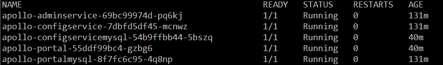
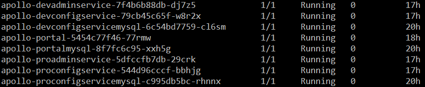

## Apollo helm

Apollo helm is a helm chart for [Apollo](https://github.com/ctripcorp/apollo)(Configuration management for distributed systems).

### TL;DR;

```
$ git clone https://github.com/qct/apollo-helm.git
$ cd apollo-helm
$ bash hack/run.sh
```

### Introduction
This chart bootstraps an Apollo deployment on a Kubernetes cluster using the Helm package manager.

### Prerequisites Details
* PV support on underlying infrastructure (if persistence is required)

### Installing the Chart
To install the chart with the release name my-release:
```
$ helm install --name my-release .
```

### Uninstalling the Chart
To uninstall/delete the my-release deployment:
```
$ helm delete my-release
```
The command removes nearly all the Kubernetes components associated with the chart and deletes the release.

### Configuration
The following table lists the configurable parameters of the Apollo chart and their default values.

As designed by Apollo, there are environments(DEV, FAT, UAT, PRO) supported by default, each environment needs an `adminservice` & a `configservice`, 
configurations of all environments can be managed by one portal, therefore, there are configurations of `adminservice` & `configservice` in four environments.

**Four environments(DEV, FAT, UAT, PRO) are enabled in this helm chart by default**, 
in case of you want to disable some environments, for example, disable UAT environment, set:
```
uatadminservice.enabled=false
uatconfigservice.enabled=false
uatconfigservicemysql=false
```

| Parameter               | Description                           | Default                                                    |
| ----------------------- | ----------------------------------    | ---------------------------------------------------------- |
| **Adminservice** |
| `devadminservice.enabled` | If true, install adminservice in dev environment | `true` |
| `devadminservice.name` | Name of adminservice in dev environment | `devadminservice` |
| `devadminservice.replicaCount` | Desired number of adminservice pods in dev environment | `1` |
| `devadminservice.image.repository` | Apollo devadminservice image | `qct222/apollo-adminservice` |
| `devadminservice.image.tag` | Apollo devadminservice image version | `1.3.0-SNAPSHOT` |
| `devadminservice.image.pullPolicy` | Apollo devadminservice image pull policy | `IfNotPresent` |
| `devadminservice.extraEnv` | Additional Apollo devadminservice container environments | `{}` |
| `devadminservice.resources` | devadminservice pod resource requests & limits | `{}` |
| `devadminservice.nodeSelector` | Node labels for kube-state-metrics pod assignment | `{}` |
| `devadminservice.tolerations` | Node taints to tolerate (requires Kubernetes >=1.6) | `[]` |
| `devadminservice.affinity` | Pod affinity | `{}` |
| `devadminservice.configMapOverrideName` | Not used at present | `""` |
| `devadminservice.configurationFiles` | Not used at present | `{}` |
| `devadminservice.service.type` | Type of devadminservice service to create | `ClusterIP` |
| `devadminservice.service.servicePort` | devadminservice service port | `8090` |
| `devadminservice.service.nodePort` | Port to be used as the service NodePort (ignored if server.service.type is not NodePort) | `nil` |
| `devadminservice.service.annotations` | Annotations for devadminservice service | `{}` |
| `devadminservice.service.loadBalancerIP` | The IP to use when web.service.type is LoadBalancer | `nil` |
| `devadminservice.service.loadBalancerSourceRanges` | devadminservice Load Balancer Source IP ranges | `nil` |
| `fatadminservice.enabled` | If true, install adminservice in dev environment | `true` |
| `fatadminservice.name` | Name of adminservice in dev environment | `fatadminservice` |
| `fatadminservice.replicaCount` | Desired number of adminservice pods in dev environment | `1` |
| `fatadminservice.image.repository` | Apollo fatadminservice image | `qct222/apollo-adminservice` |
| `fatadminservice.image.tag` | Apollo fatadminservice image version | `1.3.0-SNAPSHOT` |
| `fatadminservice.image.pullPolicy` | Apollo fatadminservice image pull policy | `IfNotPresent` |
| `fatadminservice.extraEnv` | Additional Apollo fatadminservice container environments | `{}` |
| `fatadminservice.resources` | fatadminservice pod resource requests & limits | `{}` |
| `fatadminservice.nodeSelector` | Node labels for kube-state-metrics pod assignment | `{}` |
| `fatadminservice.tolerations` | Node taints to tolerate (requires Kubernetes >=1.6) | `[]` |
| `fatadminservice.affinity` | Pod affinity | `{}` |
| `fatadminservice.configMapOverrideName` | Not used at present | `""` |
| `fatadminservice.configurationFiles` | Not used at present | `{}` |
| `fatadminservice.service.type` | Type of fatadminservice service to create | `ClusterIP` |
| `fatadminservice.service.servicePort` | fatadminservice service port | `8090` |
| `fatadminservice.service.nodePort` | Port to be used as the service NodePort (ignored if server.service.type is not NodePort) | `nil` |
| `fatadminservice.service.annotations` | Annotations for fatadminservice service | `{}` |
| `fatadminservice.service.loadBalancerIP` | The IP to use when web.service.type is LoadBalancer | `nil` |
| `fatadminservice.service.loadBalancerSourceRanges` | fatadminservice Load Balancer Source IP ranges | `nil` |
| `uatadminservice.enabled` | If true, install adminservice in dev environment | `true` |
| `uatadminservice.name` | Name of adminservice in dev environment | `uatadminservice` |
| `uatadminservice.replicaCount` | Desired number of adminservice pods in dev environment | `1` |
| `uatadminservice.image.repository` | Apollo uatadminservice image | `qct222/apollo-adminservice` |
| `uatadminservice.image.tag` | Apollo uatadminservice image version | `1.3.0-SNAPSHOT` |
| `uatadminservice.image.pullPolicy` | Apollo uatadminservice image pull policy | `IfNotPresent` |
| `uatadminservice.extraEnv` | Additional Apollo uatadminservice container environments | `{}` |
| `uatadminservice.resources` | uatadminservice pod resource requests & limits | `{}` |
| `uatadminservice.nodeSelector` | Node labels for kube-state-metrics pod assignment | `{}` |
| `uatadminservice.tolerations` | Node taints to tolerate (requires Kubernetes >=1.6) | `[]` |
| `uatadminservice.affinity` | Pod affinity | `{}` |
| `uatadminservice.configMapOverrideName` | Not used at present | `""` |
| `uatadminservice.configurationFiles` | Not used at present | `{}` |
| `uatadminservice.service.type` | Type of uatadminservice service to create | `ClusterIP` |
| `uatadminservice.service.servicePort` | uatadminservice service port | `8090` |
| `uatadminservice.service.nodePort` | Port to be used as the service NodePort (ignored if server.service.type is not NodePort) | `nil` |
| `uatadminservice.service.annotations` | Annotations for uatadminservice service | `{}` |
| `uatadminservice.service.loadBalancerIP` | The IP to use when web.service.type is LoadBalancer | `nil` |
| `uatadminservice.service.loadBalancerSourceRanges` | uatadminservice Load Balancer Source IP ranges | `nil` |
| `proadminservice.enabled` | If true, install adminservice in dev environment | `true` |
| `proadminservice.name` | Name of adminservice in dev environment | `proadminservice` |
| `proadminservice.replicaCount` | Desired number of adminservice pods in dev environment | `1` |
| `proadminservice.image.repository` | Apollo proadminservice image | `qct222/apollo-adminservice` |
| `proadminservice.image.tag` | Apollo proadminservice image version | `1.3.0-SNAPSHOT` |
| `proadminservice.image.pullPolicy` | Apollo proadminservice image pull policy | `IfNotPresent` |
| `proadminservice.extraEnv` | Additional Apollo proadminservice container environments | `{}` |
| `proadminservice.resources` | proadminservice pod resource requests & limits | `{}` |
| `proadminservice.nodeSelector` | Node labels for kube-state-metrics pod assignment | `{}` |
| `proadminservice.tolerations` | Node taints to tolerate (requires Kubernetes >=1.6) | `[]` |
| `proadminservice.affinity` | Pod affinity | `{}` |
| `proadminservice.configMapOverrideName` | Not used at present | `""` |
| `proadminservice.configurationFiles` | Not used at present | `{}` |
| `proadminservice.service.type` | Type of proadminservice service to create | `ClusterIP` |
| `proadminservice.service.servicePort` | proadminservice service port | `8090` |
| `proadminservice.service.nodePort` | Port to be used as the service NodePort (ignored if server.service.type is not NodePort) | `nil` |
| `proadminservice.service.annotations` | Annotations for proadminservice service | `{}` |
| `proadminservice.service.loadBalancerIP` | The IP to use when web.service.type is LoadBalancer | `nil` |
| `proadminservice.service.loadBalancerSourceRanges` | proadminservice Load Balancer Source IP ranges | `nil` |
| **Configservice** |
| `devconfigservice.enabled` | If true, install configservice in dev environment | `true` |
| `devconfigservice.name` | Name of configservice in dev environment | `devconfigservice` |
| `devconfigservice.replicaCount` | Desired number of configservice pods in dev environment | `1` |
| `devconfigservice.image.repository` | Apollo devconfigservice image | `qct222/apollo-configservice` |
| `devconfigservice.image.tag` | Apollo devconfigservice image version | `1.3.0-SNAPSHOT` |
| `devconfigservice.image.pullPolicy` | Apollo devconfigservice image pull policy | `IfNotPresent` |
| `devconfigservice.extraEnv` | Additional Apollo devconfigservice container environments | `{}` |
| `devconfigservice.resources` | devconfigservice pod resource requests & limits | `{}` |
| `devconfigservice.nodeSelector` | Node labels for kube-state-metrics pod assignment | `{}` |
| `devconfigservice.tolerations` | Node taints to tolerate (requires Kubernetes >=1.6) | `[]` |
| `devconfigservice.affinity` | Pod affinity | `{}` |
| `devconfigservice.configMapOverrideName` | Not used at present | `""` |
| `devconfigservice.configurationFiles` | Not used at present | `{}` |
| `devconfigservice.service.type` | Type of devconfigservice service to create | `ClusterIP` |
| `devconfigservice.service.servicePort` | devconfigservice service port | `8080` |
| `devconfigservice.service.nodePort` | Port to be used as the service NodePort (ignored if server.service.type is not NodePort) | `nil` |
| `devconfigservice.service.annotations` | Annotations for devconfigservice service | `{}` |
| `devconfigservice.service.loadBalancerIP` | The IP to use when web.service.type is LoadBalancer | `nil` |
| `devconfigservice.service.loadBalancerSourceRanges` | devconfigservice Load Balancer Source IP ranges | `nil` |
| `fatconfigservice.enabled` | If true, install configservice in dev environment | `true` |
| `fatconfigservice.name` | Name of configservice in dev environment | `fatconfigservice` |
| `fatconfigservice.replicaCount` | Desired number of configservice pods in dev environment | `1` |
| `fatconfigservice.image.repository` | Apollo fatconfigservice image | `qct222/apollo-configservice` |
| `fatconfigservice.image.tag` | Apollo fatconfigservice image version | `1.3.0-SNAPSHOT` |
| `fatconfigservice.image.pullPolicy` | Apollo fatconfigservice image pull policy | `IfNotPresent` |
| `fatconfigservice.extraEnv` | Additional Apollo fatconfigservice container environments | `{}` |
| `fatconfigservice.resources` | fatconfigservice pod resource requests & limits | `{}` |
| `fatconfigservice.nodeSelector` | Node labels for kube-state-metrics pod assignment | `{}` |
| `fatconfigservice.tolerations` | Node taints to tolerate (requires Kubernetes >=1.6) | `[]` |
| `fatconfigservice.affinity` | Pod affinity | `{}` |
| `fatconfigservice.configMapOverrideName` | Not used at present | `""` |
| `fatconfigservice.configurationFiles` | Not used at present | `{}` |
| `fatconfigservice.service.type` | Type of fatconfigservice service to create | `ClusterIP` |
| `fatconfigservice.service.servicePort` | fatconfigservice service port | `8080` |
| `fatconfigservice.service.nodePort` | Port to be used as the service NodePort (ignored if server.service.type is not NodePort) | `nil` |
| `fatconfigservice.service.annotations` | Annotations for fatconfigservice service | `{}` |
| `fatconfigservice.service.loadBalancerIP` | The IP to use when web.service.type is LoadBalancer | `nil` |
| `fatconfigservice.service.loadBalancerSourceRanges` | fatconfigservice Load Balancer Source IP ranges | `nil` |
| `uatconfigservice.enabled` | If true, install configservice in dev environment | `true` |
| `uatconfigservice.name` | Name of configservice in dev environment | `uatconfigservice` |
| `uatconfigservice.replicaCount` | Desired number of configservice pods in dev environment | `1` |
| `uatconfigservice.image.repository` | Apollo uatconfigservice image | `qct222/apollo-configservice` |
| `uatconfigservice.image.tag` | Apollo uatconfigservice image version | `1.3.0-SNAPSHOT` |
| `uatconfigservice.image.pullPolicy` | Apollo uatconfigservice image pull policy | `IfNotPresent` |
| `uatconfigservice.extraEnv` | Additional Apollo uatconfigservice container environments | `{}` |
| `uatconfigservice.resources` | uatconfigservice pod resource requests & limits | `{}` |
| `uatconfigservice.nodeSelector` | Node labels for kube-state-metrics pod assignment | `{}` |
| `uatconfigservice.tolerations` | Node taints to tolerate (requires Kubernetes >=1.6) | `[]` |
| `uatconfigservice.affinity` | Pod affinity | `{}` |
| `uatconfigservice.configMapOverrideName` | Not used at present | `""` |
| `uatconfigservice.configurationFiles` | Not used at present | `{}` |
| `uatconfigservice.service.type` | Type of uatconfigservice service to create | `ClusterIP` |
| `uatconfigservice.service.servicePort` | uatconfigservice service port | `8080` |
| `uatconfigservice.service.nodePort` | Port to be used as the service NodePort (ignored if server.service.type is not NodePort) | `nil` |
| `uatconfigservice.service.annotations` | Annotations for uatconfigservice service | `{}` |
| `uatconfigservice.service.loadBalancerIP` | The IP to use when web.service.type is LoadBalancer | `nil` |
| `uatconfigservice.service.loadBalancerSourceRanges` | uatconfigservice Load Balancer Source IP ranges | `nil` |
| `proconfigservice.enabled` | If true, install configservice in dev environment | `true` |
| `proconfigservice.name` | Name of configservice in dev environment | `proconfigservice` |
| `proconfigservice.replicaCount` | Desired number of configservice pods in dev environment | `1` |
| `proconfigservice.image.repository` | Apollo proconfigservice image | `qct222/apollo-configservice` |
| `proconfigservice.image.tag` | Apollo proconfigservice image version | `1.3.0-SNAPSHOT` |
| `proconfigservice.image.pullPolicy` | Apollo proconfigservice image pull policy | `IfNotPresent` |
| `proconfigservice.extraEnv` | Additional Apollo proconfigservice container environments | `{}` |
| `proconfigservice.resources` | proconfigservice pod resource requests & limits | `{}` |
| `proconfigservice.nodeSelector` | Node labels for kube-state-metrics pod assignment | `{}` |
| `proconfigservice.tolerations` | Node taints to tolerate (requires Kubernetes >=1.6) | `[]` |
| `proconfigservice.affinity` | Pod affinity | `{}` |
| `proconfigservice.configMapOverrideName` | Not used at present | `""` |
| `proconfigservice.configurationFiles` | Not used at present | `{}` |
| `proconfigservice.service.type` | Type of proconfigservice service to create | `ClusterIP` |
| `proconfigservice.service.servicePort` | proconfigservice service port | `8080` |
| `proconfigservice.service.nodePort` | Port to be used as the service NodePort (ignored if server.service.type is not NodePort) | `nil` |
| `proconfigservice.service.annotations` | Annotations for proconfigservice service | `{}` |
| `proconfigservice.service.loadBalancerIP` | The IP to use when web.service.type is LoadBalancer | `nil` |
| `proconfigservice.service.loadBalancerSourceRanges` | proconfigservice Load Balancer Source IP ranges | `nil` |
| **Portal** |
| `portal.enabled` | If true, install portal in dev environment | `true` |
| `portal.name` | Name of portal in dev environment | `portal` |
| `portal.replicaCount` | Desired number of portal pods in dev environment | `1` |
| `portal.image.repository` | Apollo portal image | `qct222/apollo-portal` |
| `portal.image.tag` | Apollo portal image version | `1.3.0-SNAPSHOT` |
| `portal.image.pullPolicy` | Apollo portal image pull policy | `IfNotPresent` |
| `portal.extraEnv` | Additional Apollo portal container environments | `{}` |
| `portal.resources` | portal pod resource requests & limits | `{}` |
| `portal.nodeSelector` | Node labels for kube-state-metrics pod assignment | `{}` |
| `portal.tolerations` | Node taints to tolerate (requires Kubernetes >=1.6) | `[]` |
| `portal.affinity` | Pod affinity | `{}` |
| `portal.configMapOverrideName` | Not used at present | `""` |
| `portal.configurationFiles` | Not used at present | `{}` |
| `portal.service.type` | Type of portal service to create | `ClusterIP` |
| `portal.service.servicePort` | portal service port | `8070` |
| `portal.service.nodePort` | Port to be used as the service NodePort (ignored if server.service.type is not NodePort) | `nil` |
| `portal.service.annotations` | Annotations for portal service | `{}` |
| `portal.service.loadBalancerIP` | The IP to use when web.service.type is LoadBalancer | `nil` |
| `portal.service.loadBalancerSourceRanges` | portal Load Balancer Source IP ranges | `nil` |
| `portal.ingress.enabled` | Enable portal Web Ingress | `false` |
| `portal.ingress.annotations` | Portal Web Ingress annotations | `{}` |
| `portal.ingress.hosts` | Portal Web Ingress Hostnames | `[]` |
| `portal.ingress.tls` | Portal Web Ingress TLS configuration	| `[]` |
| **Mysql** |
| `devconfigservicemysql.enabled` | If true, create mysql instance for configservice & adminservice | `true` |
| `devconfigservicemysql.mysqlUser` | User of mysql instance for configservice & adminservice | `admin` |
| `devconfigservicemysql.mysqlPassword` | Password of mysql instance for configservice & adminservice | `admin` |
| `devconfigservicemysql.mysqlRootPassword` | Root password of mysql instance for configservice & adminservice | `123456` |
| `devconfigservicemysql.mysqlDatabase` | Database of mysql instance for configservice & adminservice | `ApolloConfigDB` |
| `devconfigservicemysql.persistence.storageClass` | Mysql data Persistent Volume Storage Class | `nil` |
| `devconfigservicemysql.persistence.accessMode` | Mysql data Persistent Volume access modes | `ReadWriteOnce` |
| `devconfigservicemysql.persistence.size` | Mysql data Persistent Volume size | `2Gi` |
| `devconfigservicemysql.persistence.annotations` | Annotations for mysql Persistent Volume Claim | `{}` |
| `devconfigservicemysql.initializationFiles` | List of SQL files which are run after the container started | `initializationFiles-configservice.sql` |
| `fatconfigservicemysql.enabled` | If true, create mysql instance for configservice & adminservice | `true` |
| `fatconfigservicemysql.mysqlUser` | User of mysql instance for configservice & adminservice | `admin` |
| `fatconfigservicemysql.mysqlPassword` | Password of mysql instance for configservice & adminservice | `admin` |
| `fatconfigservicemysql.mysqlRootPassword` | Root password of mysql instance for configservice & adminservice | `123456` |
| `fatconfigservicemysql.mysqlDatabase` | Database of mysql instance for configservice & adminservice | `ApolloConfigDB` |
| `fatconfigservicemysql.persistence.storageClass` | Mysql data Persistent Volume Storage Class | `nil` |
| `fatconfigservicemysql.persistence.accessMode` | Mysql data Persistent Volume access modes | `ReadWriteOnce` |
| `fatconfigservicemysql.persistence.size` | Mysql data Persistent Volume size | `2Gi` |
| `fatconfigservicemysql.persistence.annotations` | Annotations for mysql Persistent Volume Claim | `{}` |
| `fatconfigservicemysql.initializationFiles` | List of SQL files which are run after the container started | `initializationFiles-configservice.sql` |
| `uatconfigservicemysql.enabled` | If true, create mysql instance for configservice & adminservice | `true` |
| `uatconfigservicemysql.mysqlUser` | User of mysql instance for configservice & adminservice | `admin` |
| `uatconfigservicemysql.mysqlPassword` | Password of mysql instance for configservice & adminservice | `admin` |
| `uatconfigservicemysql.mysqlRootPassword` | Root password of mysql instance for configservice & adminservice | `123456` |
| `uatconfigservicemysql.mysqlDatabase` | Database of mysql instance for configservice & adminservice | `ApolloConfigDB` |
| `uatconfigservicemysql.persistence.storageClass` | Mysql data Persistent Volume Storage Class | `nil` |
| `uatconfigservicemysql.persistence.accessMode` | Mysql data Persistent Volume access modes | `ReadWriteOnce` |
| `uatconfigservicemysql.persistence.size` | Mysql data Persistent Volume size | `2Gi` |
| `uatconfigservicemysql.persistence.annotations` | Annotations for mysql Persistent Volume Claim | `{}` |
| `uatconfigservicemysql.initializationFiles` | List of SQL files which are run after the container started | `initializationFiles-configservice.sql` |
| `proconfigservicemysql.enabled` | If true, create mysql instance for configservice & adminservice | `true` |
| `proconfigservicemysql.mysqlUser` | User of mysql instance for configservice & adminservice | `admin` |
| `proconfigservicemysql.mysqlPassword` | Password of mysql instance for configservice & adminservice | `admin` |
| `proconfigservicemysql.mysqlRootPassword` | Root password of mysql instance for configservice & adminservice | `123456` |
| `proconfigservicemysql.mysqlDatabase` | Database of mysql instance for configservice & adminservice | `ApolloConfigDB` |
| `proconfigservicemysql.persistence.storageClass` | Mysql data Persistent Volume Storage Class | `nil` |
| `proconfigservicemysql.persistence.accessMode` | Mysql data Persistent Volume access modes | `ReadWriteOnce` |
| `proconfigservicemysql.persistence.size` | Mysql data Persistent Volume size | `2Gi` |
| `proconfigservicemysql.persistence.annotations` | Annotations for mysql Persistent Volume Claim | `{}` |
| `proconfigservicemysql.initializationFiles` | List of SQL files which are run after the container started | `initializationFiles-configservice.sql` |
| `portalmysql.enabled` | If true, create mysql instance for configservice & adminservice | `true` |
| `portalmysql.mysqlUser` | User of mysql instance for configservice & adminservice | `admin` |
| `portalmysql.mysqlPassword` | Password of mysql instance for configservice & adminservice | `admin` |
| `portalmysql.mysqlRootPassword` | Root password of mysql instance for configservice & adminservice | `123456` |
| `portalmysql.mysqlDatabase` | Database of mysql instance for configservice & adminservice | `ApolloPortalDB` |
| `portalmysql.persistence.storageClass` | Mysql data Persistent Volume Storage Class | `nil` |
| `portalmysql.persistence.accessMode` | Mysql data Persistent Volume access modes | `ReadWriteOnce` |
| `portalmysql.persistence.size` | Mysql data Persistent Volume size | `2Gi` |
| `portalmysql.persistence.annotations` | Annotations for mysql Persistent Volume Claim | `{}` |
| `portalmysql.initializationFiles` | List of SQL files which are run after the container started | `initializationFiles-portaldb.sql` |


### Persistence
As designed by Apollo, configservice and adminservice share a mysql instance, while portal should use its own mysql instance.

### Warning
Take risks at your own if used in a production environment.  

### Thanks
Many thanks to ctrip [Apollo](https://github.com/ctripcorp/apollo), they bring us a so great configuration management system,
many thanks to [AiotCEO](https://github.com/AiotCEO) for the contribution of the [appolo-on-kubernetes](https://github.com/ctripcorp/apollo/tree/master/scripts/apollo-on-kubernetes) part.

### Road map
* Deploy Apollo for a single dev environment configuration management on a Kubernetes cluster :heavy_check_mark: 
* Deploy Apollo for customized environment (customization of environment quantity) :heavy_check_mark:

>Tip: Now you can use this chart to deploy any of the 4 environments(DEV, FAT, UAT, PRO), or a combination of them.

### Screenshots
  


